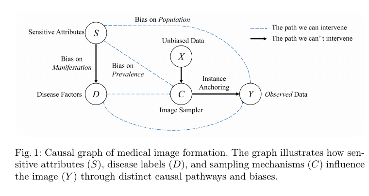
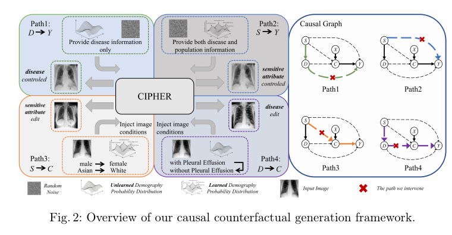

# CIPHER: Causal Intervention Pathways for Healthcare Equity and Robustness

[](#paper-alignment)
[](https://pytorch.org/)
[](https://github.com/huggingface/diffusers)

**CIPHER** is a causally grounded medical-image augmentation framework for improving fairness and robustness across sensitive subgroups. The paper formalizes four pathways through which sensitive attributes can bias observed images, then intervenes on those pathways with a diffusion backbone, classifier-free guidance, and Null-Text inversion.

This repository currently packages the **dermoscopy-oriented implementation slice** of CIPHER: diffusion fine-tuning, prompt-based global synthesis, instance-anchored counterfactual editing, and DenseNet-121 downstream evaluation.

## Paper Alignment





The manuscript defines four intervention paths:

```text
Path 1: Disease-only generation               y ~ p(Y | c_D(d'))
Path 2: Sensitive-focused generation          y ~ p(Y | concat(c_D(d), c_S(s')))
Path 3: Sensitive counterfactual editing      E(x; (d, s) -> (d, s'))
Path 4: Disease counterfactual editing        E(x; (d, s) -> (d', s))
```

In this codebase, the paths map to scripts as follows:

- `infer_code/generate_t2i.py` and `infer_code/generate_t2i_batch.py` cover the global synthesis family used for Path 1 and Path 2.
- `infer_code/generate_t2i_nulltext.py` and `infer_code/generate_t2i_nulltext_batch.py` implement the instance-anchored editing family used for Path 3 and Path 4.
- `infer_code/generate_t2i_unified_batch.py` is a convenience runner for mixing image-free and image-conditioned rows when building multi-path augmentation sets.
- `classifier_train/` contains the downstream DenseNet evaluation code used to measure subgroup-aware classifier performance after augmentation.

## Installation

Create a dedicated environment first, then install a CUDA-compatible PyTorch build followed by the project dependencies.

```bash
python -m venv .venv
source .venv/bin/activate

# Install the PyTorch build that matches your CUDA / platform first.
pip install torch torchvision torchaudio

pip install -r requirements.txt
```

Optional packages:

- `xformers` for lower-memory diffusion inference and training
- `wandb` for experiment tracking during diffusion fine-tuning

## Core Workflows

CIPHER currently supports four main workflows:

```text
1. Diffusion fine-tuning from paired dermoscopy images and prompts
2. Global synthetic generation for Path 1 / Path 2 augmentation
3. Instance-anchored counterfactual editing for Path 3 / Path 4 augmentation
4. DenseNet downstream evaluation for fairness and robustness analysis
```

## Training

### Diffusion Fine-Tuning

The diffusion pipeline expects an image directory and a prompt directory with matching file stems. In the dermoscopy setting, prompts should encode both disease semantics and subgroup metadata tokens such as age, sex, or skin-tone proxies.

```bash
accelerate launch --mixed_precision bf16 \
  train_code/train.py \
  --config_file configs/train_config_demo.yaml
```

Multi-GPU training:

```bash
accelerate launch --num_processes 4 --multi_gpu --mixed_precision bf16 \
  train_code/train.py \
  --config_file configs/train_config_demo.yaml
```

### DenseNet Classification

Train the ImageNet-initialized DenseNet baseline:

```bash
python classifier_train/run_from_config.py --config configs/config_pretrained.yaml
```

Train the scratch baseline:

```bash
python classifier_train/run_from_config.py --config configs/config_scratch.yaml
```

## Inference

### Path 1 / Path 2 Global Generation

Single-sample generation:

```bash
python infer_code/generate_t2i.py --config configs/generate_t2i.yaml
```

Batch generation from CSV:

```bash
python infer_code/generate_t2i_batch.py --config configs/generate_t2i_batch.yaml
```

Use disease-only prompts to approximate **Path 1**. Keep disease wording fixed and swap subgroup tokens to realize **Path 2**.

### Path 3 / Path 4 Instance-Anchored Editing

Single-image Null-Text inversion editing:

```bash
python infer_code/generate_t2i_nulltext.py --config configs/generate_t2i_nulltext.yaml
```

Batch editing:

```bash
python infer_code/generate_t2i_nulltext_batch.py --config configs/generate_t2i_nulltext_batch.yaml
```

Edit subgroup tokens while keeping disease text fixed to realize **Path 3**. Edit disease tokens while keeping subgroup tokens fixed to realize **Path 4**.

If you provide an Awesome-U-Net checkpoint through `--seg-checkpoint`, edits can be restricted to the lesion, normal skin, or the full image.

### Mixed-Path Assembly

```bash
python infer_code/generate_t2i_unified_batch.py --config configs/generate_t2i_unified_batch.yaml
```

This helper supports both pure text-to-image rows and image-conditioned rows in one CSV file, which is useful when constructing mixed-path CIPHER augmentation sets.

## Evaluation

Evaluate the pretrained DenseNet baseline:

```bash
python classifier_train/run_from_config.py --config configs/test_config_pretrained.yaml
```

Evaluate the scratch DenseNet baseline:

```bash
python classifier_train/run_from_config.py --config configs/test_config_scratch.yaml
```

The classifier CSV format is:

```text
column 1: image path
column 2..N: label columns
```

## Project Structure

```text
CIPHER/
|-- classifier_train/              # DenseNet training / evaluation baselines
|   |-- train_densenet_pretrained.py
|   |-- train_densenet_scratch.py
|   |-- test_densenet.py
|   |-- test_densenet_no.py
|   |-- densenet_common.py
|   `-- run_from_config.py
|-- configs/                       # Shareable example configs
|-- infer_code/                    # Path 1-4 generation and editing entry points
|   |-- generate_t2i.py
|   |-- generate_t2i_batch.py
|   |-- generate_t2i_nulltext.py
|   |-- generate_t2i_nulltext_batch.py
|   `-- generate_t2i_unified_batch.py
|-- train_code/                    # Diffusion fine-tuning code
|   |-- train.py
|   |-- dataset.py
|   |-- models.py
|   |-- train_loop.py
|   |-- pipeline.py
|   `-- config.py
|-- requirements.txt
`-- README.md
```

## Data

This repository does not ship datasets or pretrained checkpoints.

- Diffusion fine-tuning expects paired dermoscopy images and text prompts.
- Classification expects CSV manifests whose first column is the image path.
- Batch generation scripts expect CSV files with a `prompt` column and optional `image` / `input_image` columns.
Official dataset links:
- [CheXpert](https://aimi.stanford.edu/datasets/chexpert-chest-x-rays)
- [MIMIC-CXR](https://physionet.org/content/mimic-cxr/2.1.0/)
- [MILK10K](https://api.isic-archive.com/doi/milk10k/)

All config files in `configs/` are templates and should be updated to match your local paths before running experiments.

## Scope Note

The paper reports both chest X-ray and dermoscopy experiments. This repository snapshot is centered on the **dermoscopy branch** of the method; CXR-specific data preparation and report-conditioned scripts are not included here.

## License

This project is released under [Apache 2.0 License](https://github.com/fdu-farm/BrReMark/blob/main/LICENSE).

## Citation

```bibtex
@inproceedings{CIPHER2026,
  title={CIPHER: Causal Intervention Pathways for Healthcare Equity and Robustness},
  author={TODO},
  booktitle={MICCAI},
  year={2026}
}
```

## Acknowledgements

- Parts of the diffusion training code are adapted from Hugging Face Diffusers training examples.
- This work builds on Stable Diffusion for controllable medical image generation.
- This repository uses the Null-Text Inversion paradigm for instance-anchored counterfactual editing.
- The repository builds on `diffusers`, `accelerate`, `transformers`, `torchvision`, and related PyTorch tooling.
